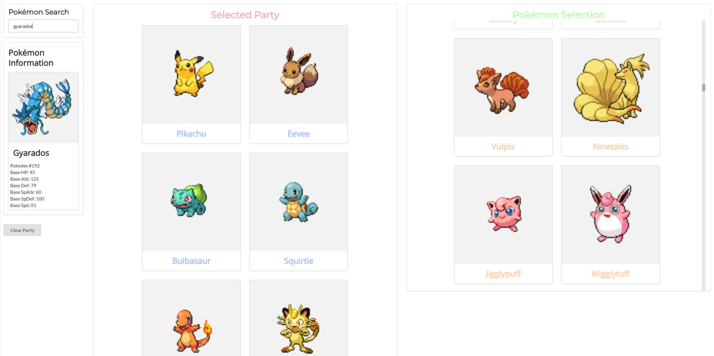

# Pokedex-React

This project was bootstrapped with [Create React App](https://github.com/facebook/create-react-app).

Pokedex-React was built to learn about the inner workings of React, particularly fetching data and displaying it appropriately. Further functionality was added through standard practices such as props and states. The API used was courtesy of PokeApi.co, found at https://pokeapi.co/

The project features three distinct panels. The first panel allows the user to search for any Pokémon in the PokeApi database. When the query is succesful, the Pokémon's Pokedex number and 6 base stats are displayed. You can choose to add the Pokémon to your party. You may also choose to do so from finding the desired Pokémon from the Selection panel.

Semantic UI was used to properly position and style the React components.

## Installation

1. Clone this project
2. Run `npm install`
3. Check that all dependencies have been installed

## Deploy for local use
Runs the app in the development mode. 
Open [http://localhost:3000](http://localhost:3000) to view it in the browser.

The page will reload if you make edits. 
You will also see any lint errors in the console.
